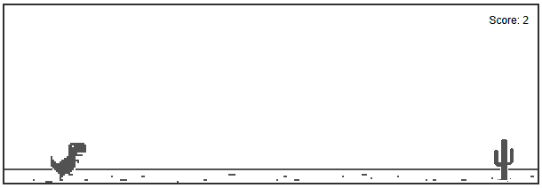
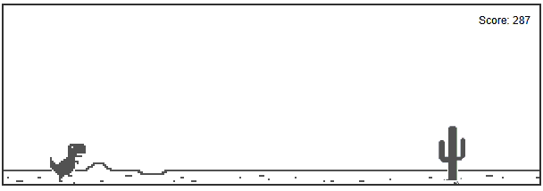
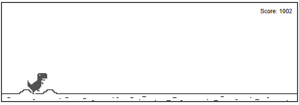
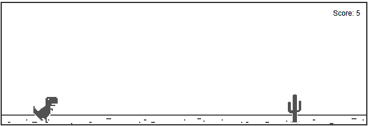
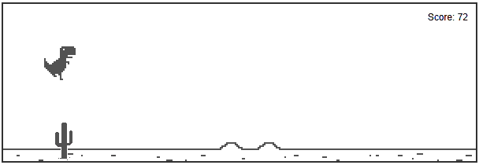
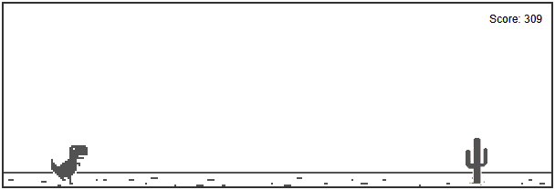
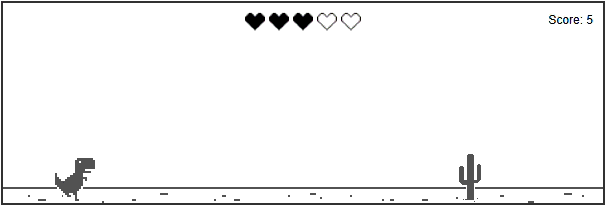
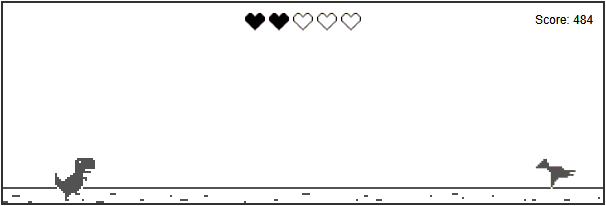
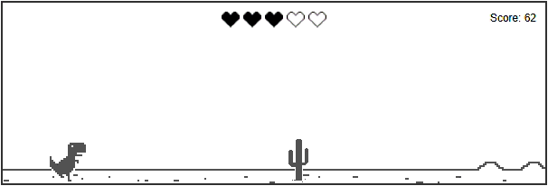

# Dino Game

This is a small web game mimicking Google's offline Dino game.

## Features

1. **Dino Controls:** The Dino runs continuously. The player can make the Dino jump by pressing the **Spacebar** or **Up-Arrow** key.
2. **Moving Background:** The game features a moving background that creates the illusion of running.
3. **Obstacles:** Trees approach the Dino in a predictable pattern with a fixed gap between them. If the Dino touches a tree, the game ends immediately.
4. **Scoring:** The score increases automatically the longer the Dino survives.
5. **Increasing Difficulty:** Once the score exceeds 200, the trees will begin to appear with random heights, adding a new level of challenge.
6. **Game Over:** When the game ends, a "GAME OVER!" text appears on the screen along with a "Restart" button. Clicking the "Restart" button displays the text "Restart button pressed".

## Setup

Open `index.html` in your browser to view the game!

## Demo

Here is a demo of the game:

  

## Code Structure

The project is built using vanilla HTML, CSS, and JavaScript.

- **`index.html`**: Contains the structural layout of the game, including the main game container, the dinosaur, tree obstacles, and the restart button.
- **`dinosaur.css`**: Defines the styles, positioning, and visual states (such as the dinosaur's running frames) for all game elements.
- **`dinosaur.js`**: Contains the core game logic and physics. Key functions include:
  - `jump()`: Applies vertical velocity to the dinosaur to simulate jumping and handles gravity.
  - `moveTree()` & `stopTreeMovement()`: Controls the horizontal movement of the tree obstacles towards the player, including logic for randomizing tree height after a certain score.
  - `startRunAnimation()` & `stopRunAnimation()`: Toggles the CSS classes of the dinosaur to animate its running legs.
  - `scrollGround()`: Continuously shifts the background image to create the illusion of forward movement.
  - `checkCollision()`: Constantly checks for bounding box overlaps between the dinosaur and the tree to detect crashes.
  - `showTextInsideGameElement()`: A helper function to dynamically create and render absolute-positioned text (like Game Over or Score) inside the game area.
  - `endGame()`: Handles the game over state by halting animations, movements, and scoring.
  - `startScore()`, `stopScore()`, `updateScoreDisplay()`: Manages the game's scoring system, incrementing the score over time.
  - `restartGame()`: Handles resetting the text states and logic when the Restart button is clicked.
  - `Math.random()`: Used throughout the challenges to generate a pseudo-random decimal number between 0 (inclusive) and 1 (exclusive). This output is then scaled to randomize obstacle heights, gap distances, and spawn sequences.

## Challenges

The examinee needs to solve these challenges:

1. **Increasing Speed:** The dino’s running speed starts at 5 units/second. Every 100 points, the speed increases by 1 unit/second.

    

2. **Unpredictable Trees:** After the score becomes more than 200, the distance between trees should be random, from 600px to 1000px, so players cannot predict exact timing.

    

3. **Working Restart Button:** Make the Restart button functional. That means, after pressing it, the game will restart from the beginning.

    

4. **Ducking Mechanic:** The dino can now duck by pressing the Down Arrow key. (Use the `dino_duck_1.png` and `dino_duck_2.png` images from the `images` folder for the ducking animation).

    

5. **Flying Birds:** Birds start spawning after the score is more than 300. Birds appear at random heights, anywhere between 10px (low swoop) and 80px (top of the dino's jump). Please remember that a bird and a tree should not appear at the same time. Birds and a trees will appear in random sequence, and birds are obstacles just like trees. (Use the `bird_1.png` and `bird_2.png` images for the bird animation).

    

6. **Life Bar:**
<ol type="a" style="margin-left:20px">
  <li>Dino starts with 3 lives. You need to display the life bar at the top centre of the screen. (Use the `blank_life.png` and `full_life.png` images to demonstrate the lives)</li>
  

    
  

  <li>A life item appears every 500 points. Collecting a life increases the life count by 1, up to a maximum of 5. (Use the `full_life.png` images to demonstrate the life item)</li>
  

    
  

  <li>Colliding with an obstacle reduces the life count by 1 instead of causing instant death. If the life count becomes 0, the game ends. Restart button should appear when the game ends.</li>
  

    
  

</ol>
